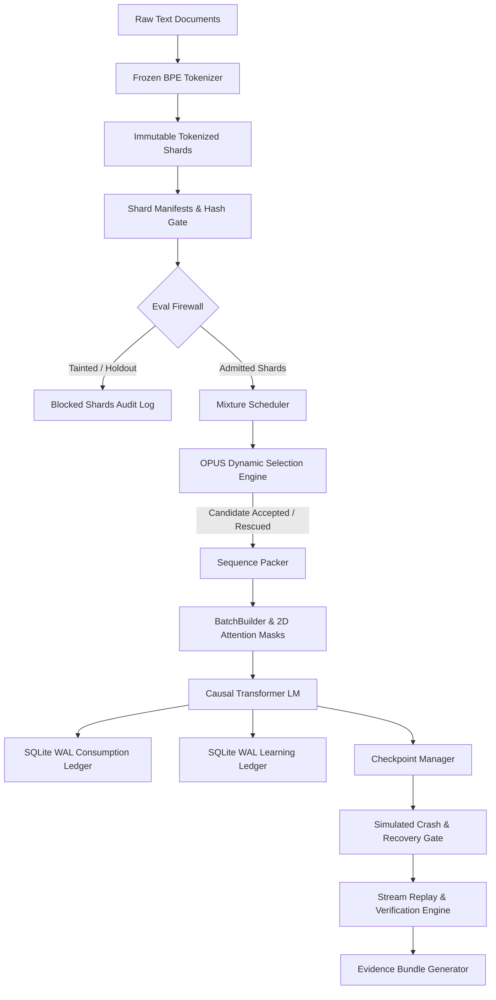

## 🏗 Architecture & Data Flow



---

## ⚙ Core Design Decisions & Subsystem Components

### 1. Frozen BPE Tokenizer ([src/tokenizer.py]( Module-6/src/tokenizer.py))
* **Algorithm**: Subword Byte-Pair Encoding (BPE) with special tokens `<PAD>` (0), `<BOS>` (1), `<EOS>` (2), `<EOD>` (3), `<UNK>` (4), raw byte tokens (`5..260`), and priority BPE pair merges (`261+`).
* **Determinism**: Produces a SHA-256 version hash (`v5.0.0-bpe-frozen`) over its vocabulary and merge tables. Reversible decoding (`decode(encode(text)) == text`) is guaranteed.

### 2. Shards & Manifest Admission Gate ([src/shards.py]( Module-6/src/shards.py), [src/manifest.py]( Module-6/src/manifest.py))
* **Content Addressing**: Each shard computes a deterministic content hash over its document sequences and metadata.
* **Manifest Gate**: Validates tokenizer hashes, deduplication status, contamination status, license tiers, and parent manifest lineage before admitting shards into training mixtures.

### 3. Evaluation Firewall ([src/eval_firewall.py]( Module-6/src/eval_firewall.py))
* **Contamination Immunity**: Enforces strict never-train holdout policies. Automatically blocks evaluation benchmark shards (e.g. `eval_003`, `gsm8k_eval`, `mmlu_eval`) and exports an audit log to `firewall.json`.

### 4. Mixture Scheduler & OPUS Engine ([src/mixture.py]( Module-6/src/mixture.py), [src/opus.py]( Module-6/src/opus.py))
* **Curriculum Scheduling**: Dynamically selects data capability lanes (`code`, `reasoning`, `indic`, `general`) based on midtraining curriculum stages.
* **OPUS Candidate Filtering**: Evaluates quality scores against thresholds, quota pressure, and **Protected-Floor Guarantees** (rescuing critical underrepresented data like `indic` from quota dropouts).

### 5. Document-Preserving Sequence Packing ([src/packer.py]( Module-6/src/packer.py), [src/batch.py]( Module-6/src/batch.py))
* **Packing Policies**: Supports `structure-preserving` and `greedy` packing.
* **Attention Isolation**: Generates 2D causal attention matrices that prevent cross-document attention leakage between packed samples within the same microbatch sequence length.
* **Position IDs & Loss Masks**: Resets position IDs per document span and guarantees that loss masks never cover padding tokens (`PAD_TOKEN_ID`).

### 6. Causal Transformer Language Model ([src/model.py]( Module-6/src/model.py))
* **Architecture**: PyTorch Causal Self-Attention Transformer LM (`CausalTransformerLM`) featuring learned positional embeddings, multi-head causal attention blocks, MLP networks with GELU activations, and token-level cross-entropy loss computation.
* **Fallback**: Features a pure-Python matrix math fallback when PyTorch is not available.

### 7. SQLite WAL Ledgers & JSONL Exports ([src/ledger.py]( Module-6/src/ledger.py))
* **Consumption Ledger**: SQLite WAL database (`microbatch_ledger`) recording served microbatches, token span IDs, loss mask hashes, batch hashes, and OpenTelemetry trace/span pointers.
* **Learning Ledger**: SQLite WAL database (`learning_ledger`) tracking token loss, perplexity clusters, loss deltas, gradient norms, and OPUS scores per sample.
* **JSONL Exporters**: Methods to export ledgers into `.jsonl` format (`consumption.jsonl`, `learning.jsonl`, `opus.jsonl`).

### 8. Checkpoint Manager & Crash Recovery ([src/checkpoint.py]( Module-6/src/checkpoint.py), [src/train_loop.py]( Module-6/src/train_loop.py))
* **Ledger Binding**: Every checkpoint payload binds model state, optimizer state, scheduler state, RNG state, and dataloader state directly to `ledger_offset`.
* **Zero-Loss Crash Recovery**: Resuming post-crash calculates the exact expected next microbatch (`b_91235`), guaranteeing zero skipped or repeated samples.
* **Historical Stream Replay**: Re-reads historical ledger offset ranges and computes SHA-256 batch digests to prove 100% deterministic replay.

---

## 📁 Repository Structure

```text
Module-6/
├── main.py                     # Trained model Q&A interaction CLI
├── run_demo.py                 # One-command end-to-end execution script
├── requirements.txt            # System dependencies (torch, numpy, pytest, opentelemetry)
├── src/
│   ├── batch.py                # MicroBatch constructor & 2D attention mask builder
│   ├── checkpoint.py           # Checkpoint Manager (tied to ledger_offset)
│   ├── eval_firewall.py        # Evaluation holdout firewall & audit log
│   ├── evidence.py             # Machine-readable evidence bundle generator
│   ├── ledger.py               # SQLite WAL Consumption & Learning Ledgers
│   ├── manifest.py             # Shard manifest builder & admission gate
│   ├── mixture.py              # Curriculum mixture scheduler
│   ├── model.py                # Causal Self-Attention Transformer LM (PyTorch)
│   ├── opus.py                 # OPUS dynamic selection & protected-floor engine
│   ├── packer.py               # Document sequence packer
│   ├── shards.py               # Tokenized shards & document classes
│   ├── tokenizer.py            # Frozen subword BPE tokenizer
│   ├── tracing.py              # OpenTelemetry span tracer & exporter
│   └── train_loop.py           # Training Execution Engine & stream replay
├── tests/                      # Automated pytest unit test suite
└── submission_artifacts/       # Generated execution artifacts bundle
    ├── run.log                 # Log of execution events and [PASS] markers
    ├── evidence.json           # Machine-readable requirement validation
    ├── evidence.md             # Human-readable evidence summary report
    ├── performance.json        # Throughput & packing utilization metrics
    ├── firewall.json           # Firewall audit rules and logs
    ├── fork.json               # Branch forking event record
    ├── manifests/              # Validated shard manifest JSON files
    ├── ledgers/                # SQLite (.db) & exported (.jsonl) ledgers
    └── checkpoints/            # Checkpoints bound to ledger offsets
```

---

## 🚀 Getting Started & Execution

### 1. One-Command Full Pipeline Demonstration
Executes the full pipeline, simulates a crash, resumes from checkpoint, verifies historical stream replay, and generates the complete `submission_artifacts/` bundle:

```bash
python run_demo.py
```

### 2. Interactive Trained Model CLI
Train or query the Causal Transformer LM interactively using subword BPE tokenization:

```bash
python main.py "What is the capital of France?"
```

### 3. Run Unit Test Suite
Run the automated pytest test suite to verify subsystem invariants:

```bash
pytest
```

---

## 📊 Summary Evidence Report (`evidence.md`)

| Requirement | Result | Evidence Pointer |
| :--- | :---: | :--- |
| **Tokenizer integrity** | **PASS** | `manifests/shard_0001.json#tokenizer_hash` |
| **Evaluation firewall** | **PASS** | `run.log#eval_shard_blocked` |
| **Packing correctness** | **PASS** | `ledgers/consumption.db#microbatches=17` |
| **Mixture compliance** | **PASS** | `ledgers/consumption.db#mixture_lane_shares` |
| **OPUS audit trail** | **PASS** | `ledgers/learning.db#opus_records=17` |
| **Crash recovery** | **PASS** | `ledgers/consumption.db#step=843219..843225` |
| **Replay** | **PASS** | `ledgers/consumption.db#batch_hash original vs replay` |
| **Learning trace** | **PASS** | `ledgers/learning.db#avg_token_loss` |
| **Throughput** | **PASS** | `performance.json` |
